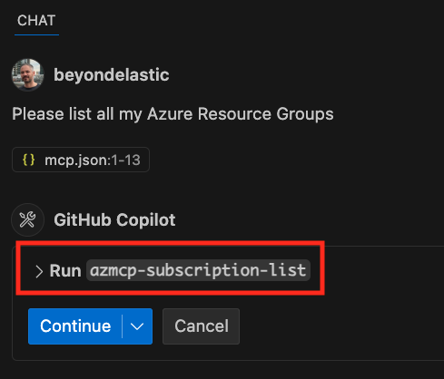
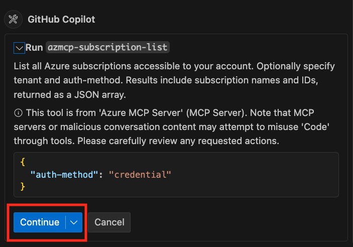

+++
date = '2025-04-11T08:37:54+02:00'
draft = false
title = 'Intro to Model Context Protocol'
categories = ['AI']
tags = ['Agents', 'MCP', 'Azure', 'Copilot', 'VS Code', 'GitHub' ]
+++

# Intro

The Model Context Protocol (MCP) is trending! What is it? Let's check it out. MCP is an open-source project launched in November 2024. It defines an open standard for AI applications to connect to their tools and data. I heard someone referring to it as the **USB adapter** for AI systems because it provides a very much needed standardization. Making your AI models smarter typically requires custom code, which can be challenging when it comes to scaling and maintaining the integrations. Most likely, your teams will end up writing the same integration multiple times for different AI use-cases. MCP allows for a **"write once, work everywhere"** approach, which will save development efforts. 

Additionally, I recommend watching the John Savill's "Model Context Protocol Overview - Why You Care!" video:



## Overview

In this blog post, I want to explain and demonstrate MCP with a simple but useful example. As everyone is currently talking about MCP and the project gains popularity, we can find more and more content about it online. For example, the collection of MCP Servers is growing by the minute. Just a couple of days ago, the public preview of [Azure MCP Server](https://devblogs.microsoft.com/azure-sdk/introducing-the-azure-mcp-server/) was announced. As I spent most of my time in VS Code working with GitHub Copilot, I want to run the Azure MCP Server locally and use VS Code as the client that connects to it. But basics first!

### MCP Server

What is an [MCP Server](https://modelcontextprotocol.io/docs/concepts/architecture)? MCP uses a client-server architecture. The MCP Server is where you build your connection to your APIs and resources. This is where the heavy lifting is done as you still have to write the integration. Nevertheless, the MCP Server then exposes your services as MCP Tools via the standardized Model Context Protocol and makes them available to your AI apps. 

The MCP Servers can run local (stdio) or remote via HTTP+SSE(Server-Sent Events) transport layer. However, the remote implementation is still in early stages and is evolving fast. The recent specs already replacing HTTP+SSE with Streamable HTTP. I found a great blog post from Christian Posta explaining the change in more detail.

- [Understanding MCP Recent Change Around HTTP+SSE](https://blog.christianposta.com/ai/understanding-mcp-recent-change-around-http-sse)

If you want to host a remote MCP Server on Azure, there are already multiple blog posts and repos available that you can follow:

- [Host remote MCP Servers on Azure App Service](https://techcommunity.microsoft.com/blog/appsonazureblog/host-remote-mcp-servers-in-azure-app-service/4405082)
- [Host remote MCP Servers on Azure Container Apps](https://techcommunity.microsoft.com/blog/appsonazureblog/host-remote-mcp-servers-in-azure-container-apps/4403550)
- [Host remote MCP Servers on Azure Functions](https://techcommunity.microsoft.com/blog/appsonazureblog/build-ai-agent-tools-using-remote-mcp-with-azure-functions/4401059)

When we talk remote MCP Servers, authentication becomes very important, and I can recommend following Den Delimarsky's blog posts and his Entra ID integration ideas. But be aware, this is also evolving fast and might be irrelevant next week. 

- [Using Microsoft Entra ID To Authenticate With MCP Servers Via Sessions](https://den.dev/blog/mcp-server-auth-entra-id-session/)

A list of example MCP Servers can be found [here](https://modelcontextprotocol.io/examples), and a quickstart on how to write your own server [here](https://modelcontextprotocol.io/quickstart/server). In this blog post, we are using a local MCP Server for the ease of use. 

### MCP Host / Client

The [MCP Host](https://modelcontextprotocol.io/docs/concepts/architecture) can be your AI app or LLM based coding client. It is responsible for generating tasks or queries, but does not directly interact with data sources or APIs. The MCP Host can create and manage multiple client instances. 

The [MCP Client](https://modelcontextprotocol.io/docs/concepts/architecture) acts as an intermediary between the MCP Host and the MCP Server. It manages connections, handles communication, discovers and executes tools, and facilitates resource access. This ensures that the AI model can perform its tasks efficiently and effectively by leveraging the capabilities of the MCP Servers.

In summary, the MCP Client acts as a bridge between the AI model and the MCP Servers.


flowchart LR
    subgraph "MCP Host"
        direction LR

        A[MCP Client]
        B[MCP Server]
        C[MCP Client]
        D[MCP Server]
        G[MCP Client]
end
E[Resource]
F[API]
I[API]
H[Remote MCP Server]
A-->B
B<-->E
C-->D
D<-->F
G-->H
H<-->I


A list of applications that support MCP can be found [here](https://modelcontextprotocol.io/clients) and a quickstart on how to build your own client [here](https://modelcontextprotocol.io/quickstart/client). Additionally, you can find more about the MCP architecture in the [documentation](https://modelcontextprotocol.io/docs/concepts/architecture) and from the latest [specifications](https://modelcontextprotocol.io/specification/2025-03-26/architecture) as of writing this blog post.

### MCP Capabilities

What are the capabilities that can be exposed by MCP Servers and used by MCP Clients?

- [**MCP Tools:**](https://modelcontextprotocol.io/docs/concepts/tools) Functions that can be invoked by your LLMs. This allows for automation and extensibility into the outside world.
- [**MCP Resources:**](https://modelcontextprotocol.io/docs/concepts/resources) Data that can be accessed by your LLMs. This allows for providing data such as files, databases, log files etc... as context to your LLMs.
- [**MCP Prompts:**](https://modelcontextprotocol.io/docs/concepts/prompts) Reusable prompt templates that can be used by your LLMs. This allows to standardize the LLM interactions.
- [**MCP Sampling:**](https://modelcontextprotocol.io/docs/concepts/sampling) Allows the MCP Server to request completions from the client. This is very early stages and the client support is still lacking. However, this can become very powerful as it enables bidirectional communication. 

## Implementation

Now that we have covered the basics, let's start with the implementation. As mentioned above, I want to use the [Azure MCP Server](https://devblogs.microsoft.com/azure-sdk/introducing-the-azure-mcp-server/) with VS Code and GitHub Copilot. 

### Prerequisites

If you want to follow along, make sure you have the following prerequisites in place:

- [Azure Subscription](https://azure.microsoft.com/en-us/pricing/purchase-options/azure-account)
- [Azure CLI](https://learn.microsoft.com/en-us/cli/azure/install-azure-cli-macos) 
- [GitHub](https://github.com/) account and a GitHub Copilot free plan or higher
- VS Code with [GitHub Copilot](https://marketplace.visualstudio.com/items?itemName=GitHub.copilot) and [Agent Mode](https://code.visualstudio.com/docs/copilot/chat/chat-agent-mode) enabled

Make sure VS Code GitHub Copilot is signed in with your GitHub account, agent mode is enabled and selected on the bottom of the chat window.


### Configuration

1. First, open a terminal in VS Code and sign in to our Azure Subscription with the ```az login```command.
2. Create an empty folder and create a .vscode folder inside the first folder.
3. Create a mcp.json file within the .vscode folder and add the following content to it. 

```json
{
  "servers": {
    "Azure MCP Server": {
      "command": "npx",
      "args": [
        "-y",
        "@azure/mcp",
        "server",
        "start"
      ]
    }
  }
}
```

**Note:** I experienced some processor architecture related issues when using "@azure/mcp@latest" package as suggested by the [blog post](https://devblogs.microsoft.com/azure-sdk/introducing-the-azure-mcp-server/) or the [repo](https://github.com/Azure/azure-mcp). I am running on a MacBook with M2 processor, and it was not finding the mcp-darwin-arm64 package. Nevertheless, after removing the @latest it was working, and the version is also identical (0.0.10 at the time of writing this blog post). 

4. After saving the mcp.json you should see a little "Start" button appearing over "Azure MCP Server". Press it!


5. This will start the Azure MCP Server, and it will discover the MCP Tools provided by it. Now we should see the discovered tools in our Agent mode chat window.


6. We can inspect the available tools by clicking on the tools icon.


So far so good, let's try the MCP Tools. 

### Execution

Now that we have everything in place, let's ask our Copilot Agent something about Azure, e.g. "list all my Azure Resource Groups". It will automatically realize that it has MCP Tools available that can help here. The Agent will also recognize that it first has to get the Azure Subscription by running the "azmcp-subscription-list" tool. We can get more details about the tool by clicking on "> Run".


  
  


After approving the tool execution by clicking "Continue" it will run the first tool and ask to execute the second tool to list my Resource Groups. As soon as we approve the next step, it will show us a list with our Resource Groups.


Awesome, we can now use the MCP Tools provided by our Azure MCP Server to execute [azd](https://learn.microsoft.com/en-us/azure/developer/azure-developer-cli/) commands directly or query logs and more. Combine this with the [Azure extension](https://marketplace.visualstudio.com/items?itemName=ms-azuretools.vscode-azure-github-copilot) for GitHub Copilot and you have a powerful Azure toolset directly in VS Code GitHub Copilot.

## Summary

To summarize, MCP provides a very much needed standardization in the ever-growing AI Agent space. We can already see that multiple vendors adopt it and provide MCP Servers for their solutions. In addition, the amount of community provided MCP Servers is growing by the minute. In an ideal case, you don't have to write your own MCP Server, you just look it up in an MCP Server registry. 

Here is a list of popular MCP Server registries:

- [https://mcp.so/servers](https://mcp.so/servers)
- [https://glama.ai/mcp/servers](https://glama.ai/mcp/servers) ​
- [https://smithery.ai/](https://smithery.ai/)
- [https://www.pulsemcp.com/servers](https://www.pulsemcp.com/servers)

If you wonder, is it is possible to use [Azure AI Agent Service](https://beyondelastic.github.io/posts/agent/) with MCP, it is. There is a great blog post available [here](https://devblogs.microsoft.com/foundry/integrating-azure-ai-agents-mcp/). It describes how to use Azure AI Agents as MCP Tools. Which might sounds strange in the first moment as it works the other way around. In this scenario, the MCP Server uses the agent or multiple agents as tools instead of the agent querying the MCP Server for exposed tools. Which makes a lot of sense if you think about the many ootb tools and Azure integrations that are available with the Azure AI Agent Service.

Besides MCP, there is another standard that was just recently announced by Google. The [A2A protocol](https://learnopencv.com/googles-a2a-protocol-heres-what-you-need-to-know/), which caters more to the agent to agent collaboration across platforms. It is definitely worth to follow both projects and see how they evolve. There is no doubt the future of agentic apps looks bright. 

## Resources

- [Azure MCP Server](https://devblogs.microsoft.com/azure-sdk/introducing-the-azure-mcp-server/)
- [MCP architecture documentation](https://modelcontextprotocol.io/docs/concepts/architecture)
- [MCP Server quickstart](https://modelcontextprotocol.io/quickstart/server)
- [MCP Server examples](https://modelcontextprotocol.io/examples)
- [MCP Client quickstart](https://modelcontextprotocol.io/quickstart/client)
- [MCP Client examples](https://modelcontextprotocol.io/clients)
- [MCP specifications 26.03.2025](https://modelcontextprotocol.io/specification/2025-03-26/architecture)
- [MCP Tools](https://modelcontextprotocol.io/docs/concepts/tools)
- [MCP Resources](https://modelcontextprotocol.io/docs/concepts/resources)
- [MCP Prompts](https://modelcontextprotocol.io/docs/concepts/prompts)
- [MCP Sampling](https://modelcontextprotocol.io/docs/concepts/sampling)
- [Understanding MCP Recent Change Around HTTP+SSE](https://blog.christianposta.com/ai/understanding-mcp-recent-change-around-http-sse)
- [Host remote MCP Servers on Azure App Service](https://techcommunity.microsoft.com/blog/appsonazureblog/host-remote-mcp-servers-in-azure-app-service/4405082)
- [Host remote MCP Servers on Azure Container Apps](https://techcommunity.microsoft.com/blog/appsonazureblog/host-remote-mcp-servers-in-azure-container-apps/4403550)
- [Host remote MCP Servers on Azure Functions](https://techcommunity.microsoft.com/blog/appsonazureblog/build-ai-agent-tools-using-remote-mcp-with-azure-functions/4401059)
- [Using Microsoft Entra ID To Authenticate With MCP Servers Via Sessions](https://den.dev/blog/mcp-server-auth-entra-id-session/)
- [Azure Subscription](https://azure.microsoft.com/en-us/pricing/purchase-options/azure-account)
- [Azure CLI documentation](https://learn.microsoft.com/en-us/cli/azure/install-azure-cli-macos) 
- [GitHub account](https://github.com/)
- [VS Code GitHub Copilot](https://marketplace.visualstudio.com/items?itemName=GitHub.copilot)  
- [GitHub Copilot Agent Mode](https://code.visualstudio.com/docs/copilot/chat/chat-agent-mode)
- [Azure Developer CLI](https://learn.microsoft.com/en-us/azure/developer/azure-developer-cli/)
- [GitHub Copilot Azure extension](https://marketplace.visualstudio.com/items?itemName=ms-azuretools.vscode-azure-github-copilot)
- [Azure AI Agent Service](https://beyondelastic.github.io/posts/agent/)
- [MCP with Azure AI Agent Service](https://devblogs.microsoft.com/foundry/integrating-azure-ai-agents-mcp/)
- [A2A protocol](https://learnopencv.com/googles-a2a-protocol-heres-what-you-need-to-know/)
